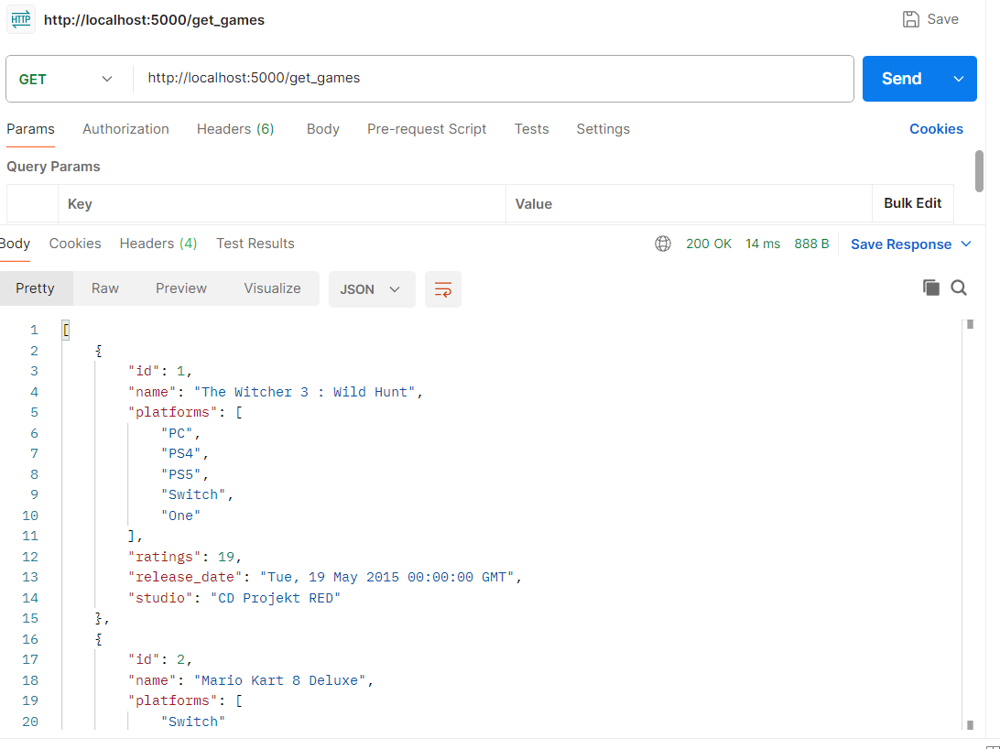
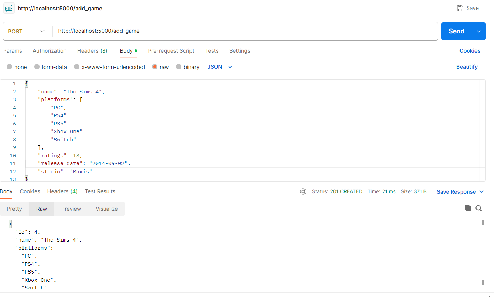
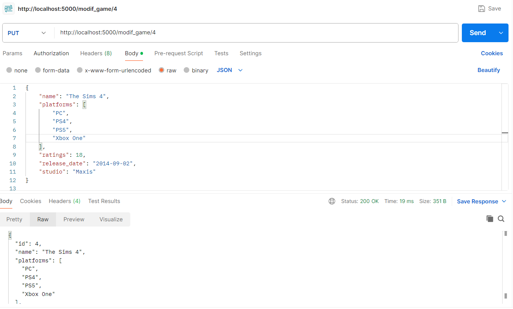
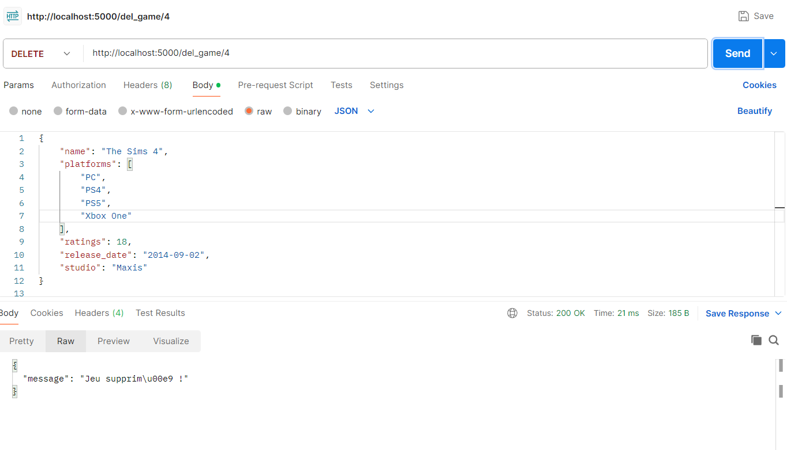

# Exercice Back-end Python

## Execution
1. Construire l'image Docker 
```sh
docker-compose build
```
2. Lancer les conteneurs
```sh
docker-compose up
```
3. Ouvrir l'API
http://localhost:5000(+ route)

## Description 

| Méthode | URL | Description |
|---|---|---|
| GET | /get_games | Retourne la liste des jeux |
| POST | /add_game | Ajoute un jeu |
| PUT | /modif_game | Modifie un jeu existant |
| DELETE | /del_game | Supprime un jeu existant |

## Tests

J'ai effectué mes tests à l'aide de **Postman** et en voici des captures d'écran:




